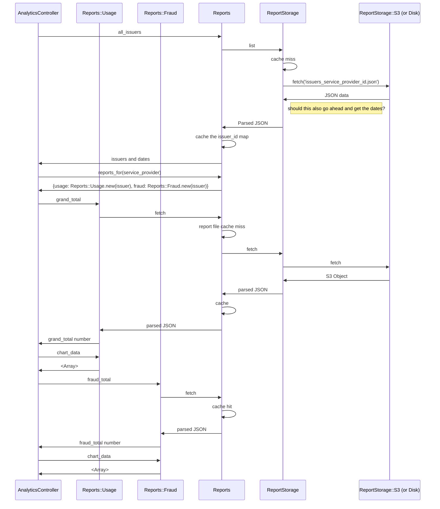

This diagram represents the expected workflow of using reports

```mermaid
sequenceDiagram
  participant Control as AnalyticsController
  participant Usage as Reports::Usage
  participant Fraud as Reports::Fraud
  participant Reports
  participant Storage as ReportStorage
  participant S3 as ReportStorage::S3 (or Disk)
  Control->>Reports: all_issuers
  Reports->>Storage: list
  Storage->>Storage: cache miss
  Storage->>S3: fetch('issuers_service_provider_id.json')
  S3->>Storage: JSON data 
  Note left of S3: should this also go ahead and get the dates?
  Storage->>Reports: Parsed JSON
  Reports->>Reports: cache the issuer_id map
  Reports->>Control: issuers and dates
  Control->>Reports: reports_for(service_provider)
  Reports->>Control: {usage: Reports::Usage.new(issuer), fraud: Reports::Fraud.new(issuer)}
  Control->>Usage: grand_total
  Usage->>Reports: fetch
  Reports->>Reports: report file cache miss
  Reports->>Storage: fetch
  Storage->>S3: fetch
  S3->>Storage: S3 Object
  Storage->>Reports: parsed JSON
  Reports->>Reports: cache
  Reports->>Usage: parsed JSON
  Usage->>Control: grand_total number
  Control->>Usage: chart_data
  Usage->>Control: <Array>
  Control->>Fraud: fraud_total
  Fraud->>Reports: fetch
  Reports->>Reports: cache hit
  Reports->>Fraud: parsed JSON
  Fraud->>Control: fraud_total number
  Control->>Fraud: chart_data
  Fraud->>Control: <Array>
```
